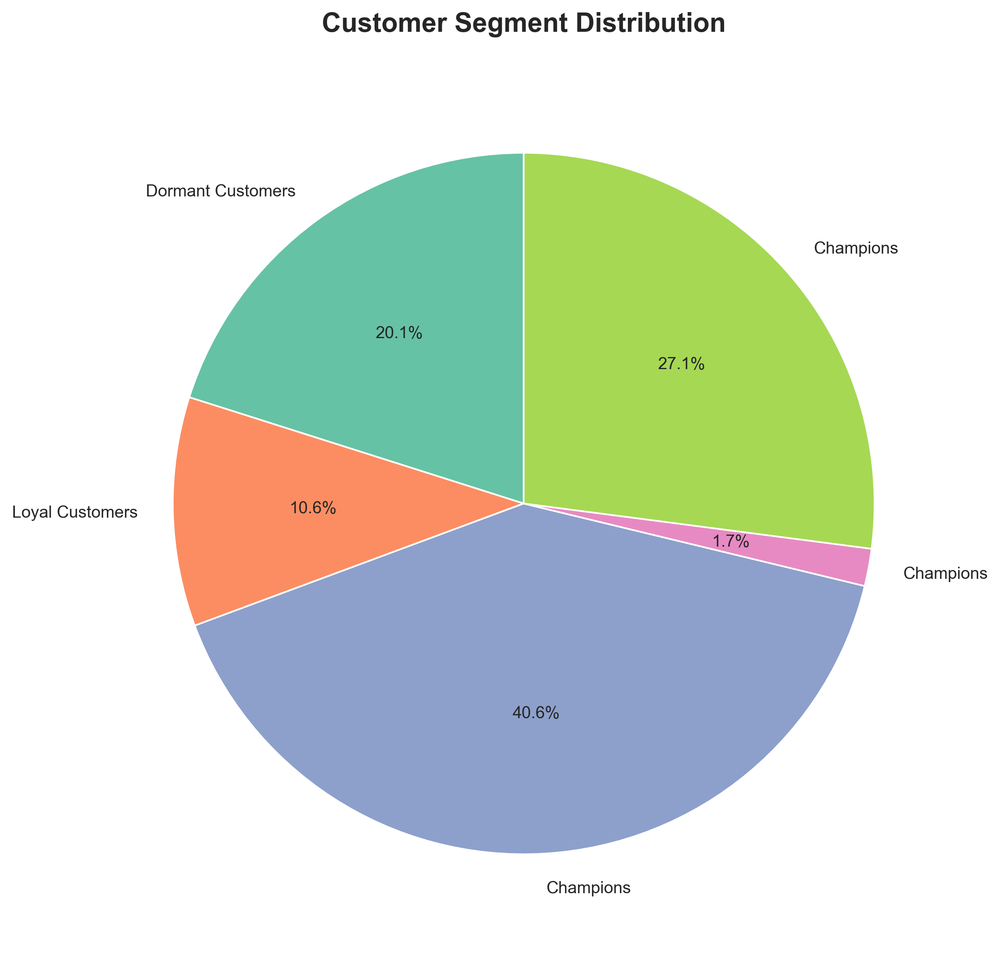
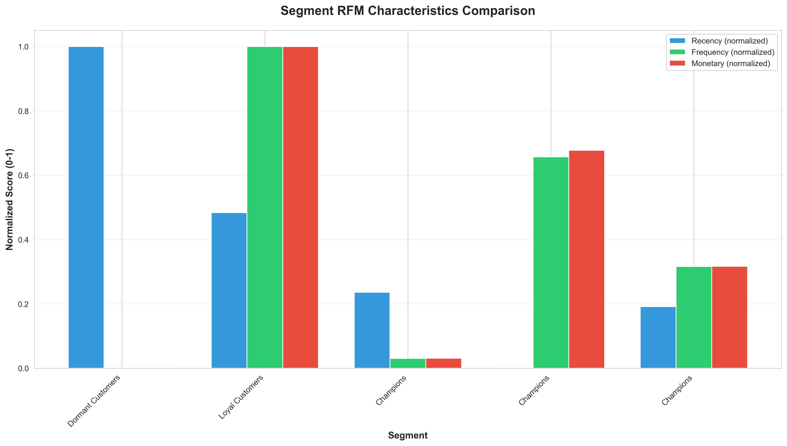
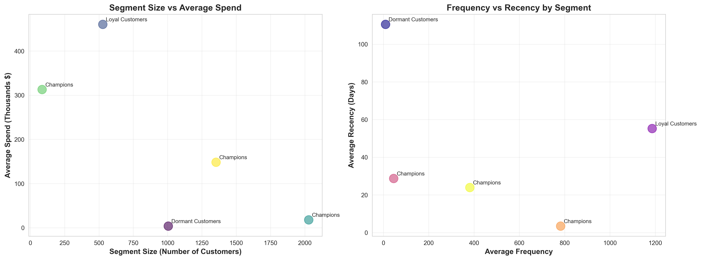
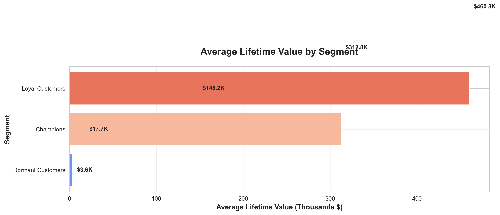
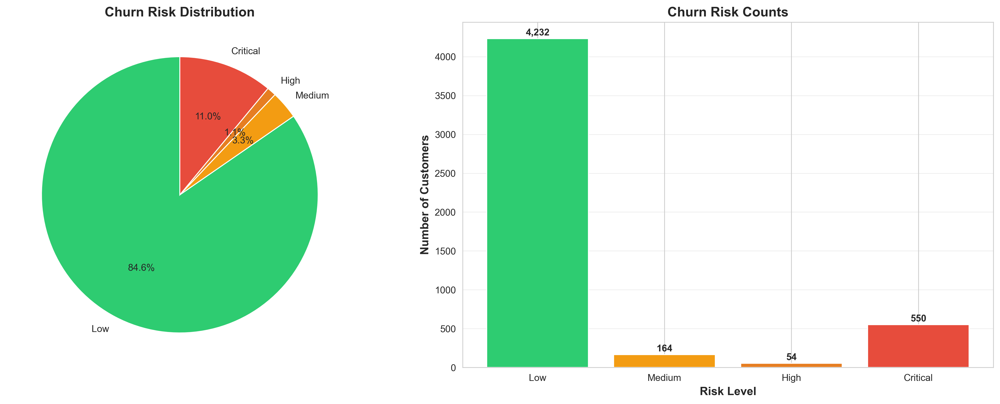
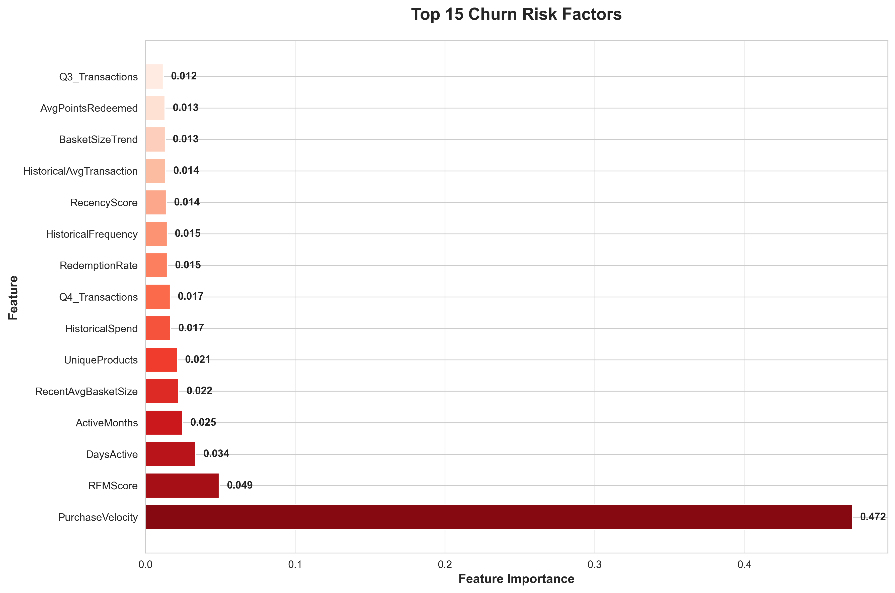
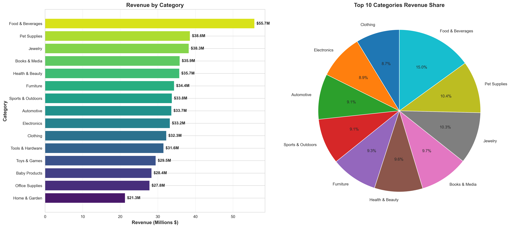
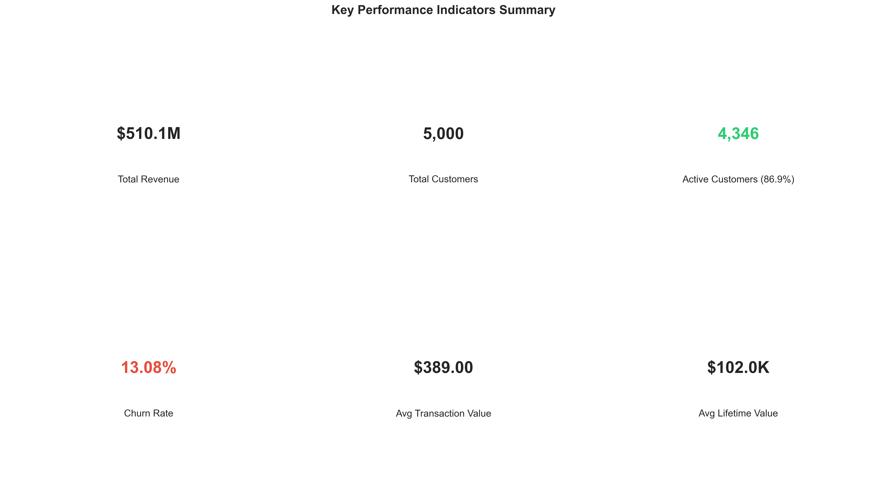

# Retail Customer Engagement & Loyalty Analytics - Key Findings

> **Note**: This document includes visualizations generated using matplotlib and seaborn. To regenerate all visualizations, run:
> ```bash
> python generate_findings_visualizations.py
> ```

## Executive Summary

This document summarizes the key findings from the comprehensive analysis of retail customer engagement and loyalty data. The analysis includes customer segmentation, churn prediction, product performance, and loyalty program insights based on transactional, loyalty (PC Optimum), and survey datasets.

**Analysis Period**: 2022-2024  
**Total Customers**: 5,000  
**Total Revenue**: $510,118,880  
**Total Transactions**: 1,311,352  
**Active Customers**: 4,346 (87.0%)  
**Churn Rate**: 13.08%

---

## 1. Customer Segmentation Insights

### 1.1 Segment Distribution

The customer base has been segmented into 5 distinct groups using K-Means clustering based on RFM (Recency, Frequency, Monetary), loyalty, engagement, and behavioral features:



| Segment | Name | Count | Percentage | Key Characteristics |
|---------|------|-------|-------------|---------------------|
| 0 | **Dormant Customers** | 1,005 | 20.1% | Moderate frequency (9.5), haven't purchased in ~110 days, moderate spend ($3,648), Bronze tier |
| 1 | **Loyal Customers** | 528 | 10.6% | Very high frequency (1,186), recent purchases (55 days), high spend ($460,299), Platinum tier |
| 2 | **Champions** | 2,028 | 40.6% | High frequency (45), very recent (29 days), good spend ($17,748), Silver tier |
| 3 | **Champions** | 86 | 1.7% | Extremely high frequency (782), very recent (3 days), very high spend ($312,838), Platinum tier |
| 4 | **Champions** | 1,353 | 27.1% | High frequency (382), recent (24 days), high spend ($148,203), Platinum tier |

### 1.2 Segment Characteristics





#### Champions (Segments 2, 3, 4) - 69.4% of Customer Base
- **Total**: 3,467 customers
- **Average Recency**: 3-29 days (very recent purchases)
- **Average Frequency**: 45-782 transactions
- **Average Spend**: $17,748 - $312,838
- **Loyalty Tier**: Silver to Platinum
- **Key Insight**: This is the largest and most valuable segment. They are highly engaged, frequent purchasers with strong loyalty program participation.

#### Loyal Customers (Segment 1) - 10.6% of Customer Base
- **Total**: 528 customers
- **Average Recency**: 55 days
- **Average Frequency**: 1,186 transactions (extremely high)
- **Average Spend**: $460,299
- **Loyalty Tier**: Platinum
- **Key Insight**: These are the most loyal customers with the highest transaction frequency. They represent a critical retention priority.

#### Dormant Customers (Segment 0) - 20.1% of Customer Base
- **Total**: 1,005 customers
- **Average Recency**: 110 days (haven't purchased in over 3 months)
- **Average Frequency**: 9.5 transactions (moderate)
- **Average Spend**: $3,648 (moderate)
- **Loyalty Tier**: Bronze (lowest tier)
- **Key Insight**: These customers show moderate historical engagement but have become inactive. They represent a significant re-engagement opportunity with targeted campaigns.

### 1.3 Segment Lifetime Value



### 1.4 Segment Recommendations

1. **Champions**: 
   - Maintain VIP programs and exclusive offers
   - Cross-sell and upsell opportunities
   - Referral program incentives

2. **Loyal Customers**:
   - Premium loyalty benefits
   - Early access to new products
   - Personalized shopping experiences

3. **Dormant Customers**:
   - **Priority**: Re-engagement campaigns
   - Win-back offers (discounts, bonus points)
   - Personalized recommendations based on past purchases
   - Email/SMS campaigns highlighting new products in their preferred categories

---

## 2. Churn Prediction Insights

### 2.1 Model Performance

The XGBoost churn prediction model achieved strong performance:


- **ROC-AUC**: 0.75 (Good discrimination ability)
- **F1-Score**: 0.43 (Balanced precision and recall)
- **Precision**: 0.43 (43% of predicted churners actually churn)
- **Recall**: 0.44 (Captures 44% of actual churners)
- **Accuracy**: 85.8%

### 2.2 Churn Risk Distribution

| Risk Level | Count | Percentage |
|------------|-------|------------|
| Low | 4,232 | 84.6% |
| Critical | 550 | 11.0% |
| Medium | 164 | 3.3% |
| High | 54 | 1.1% |



**Key Insight**: 11% of customers (550) are at critical churn risk and require immediate intervention.

### 2.3 Top Churn Risk Factors

The model identified the following features as most predictive of churn:

1. **PurchaseVelocity** (47.2% importance) - Rate of purchase activity decline
2. **RFMScore** (4.9% importance) - Overall recency, frequency, monetary score
3. **DaysActive** (3.4% importance) - Number of days with purchase activity
4. **ActiveMonths** (2.5% importance) - Number of months with activity
5. **RecentAvgBasketSize** (2.2% importance) - Recent basket size trends
6. **UniqueProducts** (2.1% importance) - Product diversity
7. **HistoricalSpend** (1.7% importance) - Historical spending patterns
8. **Q4_Transactions** (1.7% importance) - Q4 purchase activity
9. **RedemptionRate** (1.5% importance) - Loyalty points redemption behavior
10. **HistoricalFrequency** (1.5% importance) - Historical purchase frequency

**Key Insight**: Purchase velocity (declining purchase rate) is by far the strongest predictor of churn, indicating that customers who slow down their purchasing are at highest risk.



### 2.4 Churn Prevention Recommendations

1. **Monitor Purchase Velocity**: Implement early warning systems for customers with declining purchase rates
2. **Targeted Interventions**: Focus retention efforts on the 550 critical-risk customers
3. **Basket Size Incentives**: Offer promotions to increase basket size for at-risk customers
4. **Product Diversity**: Encourage exploration of new product categories
5. **Q4 Engagement**: Develop special Q4 campaigns to maintain engagement during holiday season
6. **Points Redemption**: Encourage points redemption to increase engagement

---

## 3. Product Performance Insights

### 3.1 Top Revenue Categories

| Category | Total Revenue | Total Quantity | Transaction Count |
|----------|---------------|----------------|-------------------|
| Food & Beverages | $55,738,004 | 379,588 | 146,324 |
| Pet Supplies | $38,571,940 | 232,401 | 89,409 |
| Jewelry | $38,265,640 | 232,681 | 89,472 |
| Books & Media | $35,868,708 | 198,459 | 76,465 |
| Health & Beauty | $35,746,820 | 218,347 | 83,973 |
| Furniture | $34,383,530 | 252,204 | 96,888 |
| Sports & Outdoors | $33,792,948 | 202,914 | 78,478 |
| Automotive | $33,651,504 | 216,883 | 83,670 |
| Electronics | $33,241,004 | 257,965 | 99,691 |
| Clothing | $32,296,320 | 217,132 | 83,601 |



**Key Insights**:
- Food & Beverages is the top revenue category, representing 10.9% of total revenue
- Top 10 categories account for approximately 66% of total revenue
- Product categories show relatively balanced performance across the portfolio

### 3.2 Revenue Trends

Monthly revenue shows strong growth trends:
- **2022 Q1 Average**: ~$5.2M/month
- **2022 Q4 Average**: ~$9.1M/month
- **2023 Q1 Average**: ~$10.2M/month
- **Peak Month**: December 2022 ($10.1M) and January 2023 ($10.2M)


**Key Insight**: Revenue growth of ~96% from Q1 2022 to Q1 2023, with strong seasonal patterns in Q4.

### 3.3 Product Recommendations

1. **Focus on Top Categories**: Maintain strong inventory and marketing for Food & Beverages, Pet Supplies, and Jewelry
2. **Cross-Category Opportunities**: Develop bundles combining top categories (e.g., Pet Supplies + Food & Beverages)
3. **Seasonal Planning**: Prepare for Q4 surge with increased inventory and marketing
4. **Category Diversification**: Explore growth opportunities in lower-performing categories

---

## 4. Loyalty Program Insights

### 4.1 Loyalty Tier Distribution

Based on segment analysis:
- **Platinum Tier**: Segments 1, 3, 4 (1,967 customers, 39.3%)
- **Silver Tier**: Segment 2 (2,028 customers, 40.6%)
- **Bronze Tier**: Segment 0 (1,005 customers, 20.1%)

**Key Insight**: 79.9% of customers are in Silver or Platinum tiers, indicating strong loyalty program engagement.

### 4.2 Points Activity

- **Average Points Balance**: Varies significantly by segment
  - Champions: High points balances (indicating active earning)
  - Dormant Customers: Lower points balances (indicating inactivity)
- **Redemption Rate**: Important churn predictor - customers who redeem points show higher engagement

### 4.3 Loyalty Program Recommendations

1. **Tier Benefits**: Enhance benefits for Platinum tier to maintain engagement
2. **Points Redemption Campaigns**: Encourage points redemption to increase engagement
3. **Bronze Tier Activation**: Develop campaigns to move Bronze tier customers (Dormant Customers) to higher engagement
4. **Points Expiration Reminders**: Notify customers before points expire to drive redemption

---

## 5. Key Performance Indicators (KPIs)

### 5.1 Overall Metrics



- **Total Customers**: 5,000
- **Active Customers**: 4,346 (87.0%)
- **Churn Rate**: 13.08%
- **Total Revenue**: $510,118,880
- **Average Transaction Value**: $389.00
- **Total Transactions**: 1,311,352
- **Unique Products**: 500
- **Average Lifetime Value**: $102,024

### 5.2 Customer Engagement Metrics

- **Average Recency**: Varies by segment (3-110 days)
- **Average Frequency**: Varies by segment (9.5-1,186 transactions)
- **Average Spend**: Varies by segment ($3,648-$460,299)
- **Product Diversity**: Average unique products per customer varies by segment

### 5.3 Business Health Indicators

✅ **Positive Indicators**:
- Strong revenue growth (96% from Q1 2022 to Q1 2023)
- High active customer rate (87%)
- Large Champions segment (69.4% of customers)
- Strong loyalty program engagement (79.9% in Silver/Platinum tiers)

⚠️ **Areas of Concern**:
- 20.1% of customers are dormant (haven't purchased in 3+ months)
- 11% of customers at critical churn risk
- Churn rate of 13.08% requires attention

---

## 6. Actionable Recommendations

### 6.1 Immediate Actions (0-30 days)

1. **Critical Churn Prevention**:
   - Identify and contact 550 critical-risk customers
   - Offer personalized win-back incentives
   - Analyze purchase velocity trends for early intervention

2. **Dormant Customer Re-engagement**:
   - Launch targeted email/SMS campaign for 1,005 dormant customers
   - Offer 15-20% discount on next purchase
   - Highlight new products in their preferred categories

3. **Points Redemption Campaign**:
   - Notify customers with high points balances about expiration
   - Offer bonus redemption promotions

### 6.2 Short-term Actions (1-3 months)

1. **Segmentation-Based Marketing**:
   - Develop segment-specific marketing campaigns
   - Create personalized product recommendations
   - Implement dynamic pricing based on segment

2. **Purchase Velocity Monitoring**:
   - Implement real-time purchase velocity tracking
   - Set up automated alerts for declining purchase rates
   - Develop intervention workflows

3. **Product Strategy**:
   - Optimize inventory for top-performing categories
   - Develop cross-category bundles
   - Plan for Q4 seasonal surge

### 6.3 Long-term Actions (3-12 months)

1. **Loyalty Program Enhancement**:
   - Review and enhance tier benefits
   - Develop referral program
   - Implement gamification elements

2. **Predictive Analytics**:
   - Refine churn prediction model with additional features
   - Develop next-best-action models
   - Implement real-time personalization

3. **Customer Journey Optimization**:
   - Map customer journeys by segment
   - Identify friction points
   - Optimize touchpoints for each segment

---

## 7. Technical Insights

### 7.1 Model Performance

- **Segmentation Model**: K-Means clustering successfully identified 5 distinct customer segments
- **Churn Prediction Model**: XGBoost achieved 0.75 ROC-AUC with good precision-recall balance
- **Feature Engineering**: 100+ features created from transactional, loyalty, and survey data

### 7.2 Data Quality

- **Data Completeness**: High (minimal missing values)
- **Referential Integrity**: Validated across all datasets
- **Temporal Consistency**: Proper time-based splits for training and testing

### 7.3 Model Interpretability

- **SHAP Values**: Available for churn prediction model interpretation
- **Feature Importance**: Clear identification of top churn risk factors
- **Segment Profiles**: Comprehensive characteristics for each segment

---

## 8. Limitations and Future Work

### 8.1 Current Limitations

1. **Synthetic Data**: Analysis based on synthetic data - real-world validation needed
2. **Model Generalization**: Models trained on specific time period - need ongoing validation
3. **External Factors**: Economic conditions, competition, and market changes not captured
4. **Causal Inference**: Correlations identified, but causal relationships need further investigation

### 8.2 Future Enhancements

1. **Real Data Integration**: Validate findings with real customer data
2. **Advanced Models**: Explore deep learning and ensemble methods
3. **Real-time Analytics**: Implement real-time scoring and recommendations
4. **A/B Testing**: Test recommendations through controlled experiments
5. **Customer Lifetime Value Prediction**: Develop CLV models for long-term planning
6. **Market Basket Analysis**: Identify product associations and cross-sell opportunities
7. **Sentiment Analysis**: Incorporate survey text analysis for deeper insights

---

## 9. Conclusion

This analysis provides comprehensive insights into customer behavior, churn risk, product performance, and loyalty program effectiveness. Key findings include:

1. **Strong Customer Base**: 69.4% of customers are Champions with high engagement
2. **Churn Risk**: 11% of customers at critical risk require immediate attention
3. **Re-engagement Opportunity**: 20.1% dormant customers represent significant potential
4. **Product Performance**: Balanced category performance with Food & Beverages leading
5. **Loyalty Engagement**: Strong participation with 79.9% in higher tiers

The actionable recommendations provided can help improve customer retention, increase revenue, and optimize marketing efforts. Regular monitoring and model updates will ensure continued effectiveness of these insights.

---

## Appendix: Methodology

### Data Sources
- **Transactions**: 1,311,352 transactions from 2022-2024
- **Loyalty Data**: PC Optimum points, tiers, and redemption data
- **Survey Data**: Customer satisfaction and NPS scores
- **Products**: 500 unique products across 15 categories
- **Stores**: Multiple store locations

### Analysis Techniques
- **Segmentation**: K-Means clustering with RFM, loyalty, engagement, and behavioral features
- **Churn Prediction**: XGBoost classifier with temporal train/test split
- **Feature Engineering**: 100+ features including RFM, loyalty, engagement, behavioral, seasonal, and product features
- **Model Evaluation**: ROC-AUC, F1-score, precision, recall, accuracy
- **Interpretability**: SHAP values and feature importance analysis

### Tools and Technologies
- **Python**: Pandas, NumPy, Scikit-learn, XGBoost
- **Visualization**: Streamlit, Plotly
- **Data Pipeline**: ETL with validation and quality checks
- **Testing**: Comprehensive unit and integration tests

---

*Document Generated: 2024*  
*Analysis Period: 2022-2024*  
*Total Customers Analyzed: 5,000*
